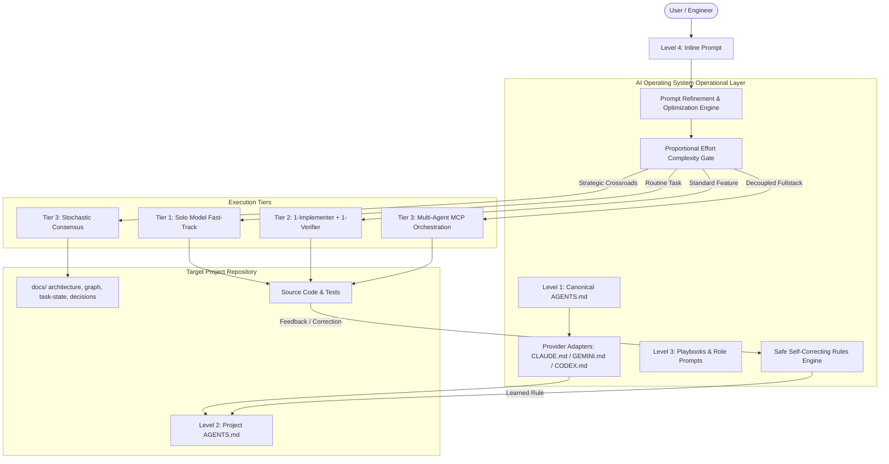
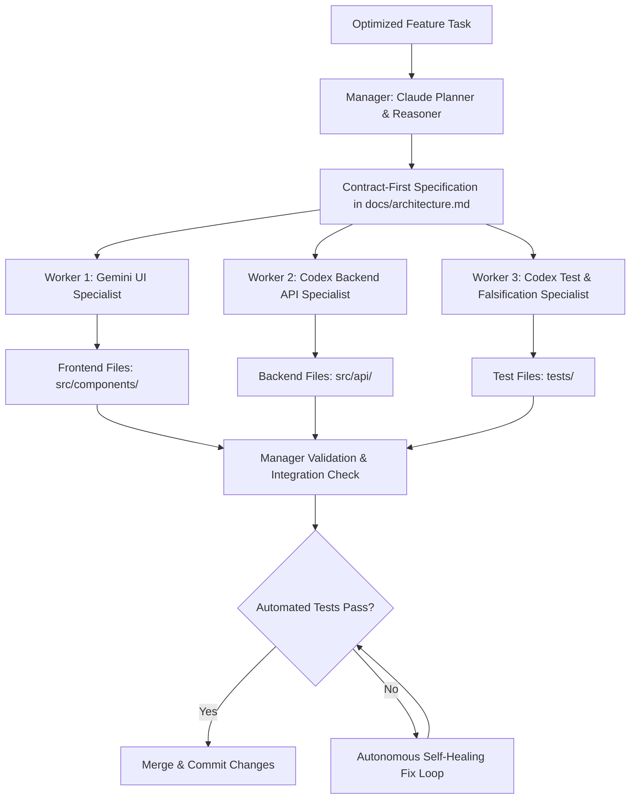
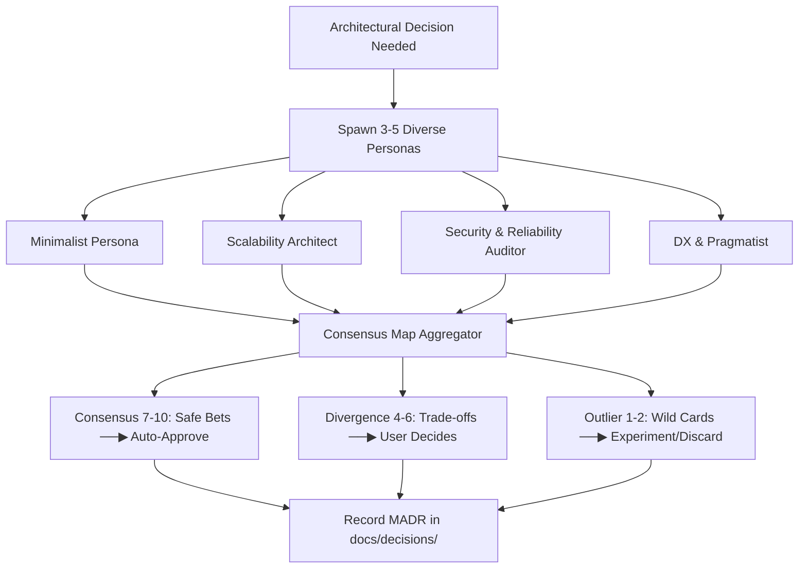

# AI Operating System: Architecture & Operational Graph

This graph maps the structural components, execution lifecycle, and cross-cutting subsystems of the **AI Operating System**.

---

## 1. High-Level System Architecture Graph

---

## 2. Multi-Agent MCP Orchestration Graph

---

## 3. Stochastic Consensus Decision Graph

---

## 4. Subsystem & File Dependency Matrix

| AI-OS Subsystem | File References | Primary Role | Downstream Artifact |
| --- | --- | --- | --- |
| **Canonical Rules Engine** | `AGENTS.md`, `CLAUDE.md`, `GEMINI.md`, `CODEX.md` | Single source of truth | `<project>/AGENTS.md` |
| **Prompt Refinement** | `playbooks/prompt-refinement.md` | Upgrades raw messy prompts | `<project>/docs/task-state.md` |
| **Multi-Agent MCP** | `playbooks/multi-agent-orchestration.md` | Coordinates parallel workers | `<project>/mcp.json` |
| **Stochastic Consensus** | `playbooks/stochastic-consensus.md` | Eliminates hallucinations | `<project>/docs/decisions/` |
| **Token Optimization** | `playbooks/token-optimization.md` | Prompt caching & lean context | 5x faster generation |
| **Scaffolding CLI** | `scripts/init-project.ps1`, `scripts/init-project.sh` | One-shot setup in 2s | New project workspace |
| **Federated Learning** | `scripts/sync-rules.ps1` | Propagates universal rules | Master `AGENTS.md` |
| **Pre-Commit Guard** | `templates/project/.githooks/pre-commit` | Blocks secret leaks | Git commit safety |
